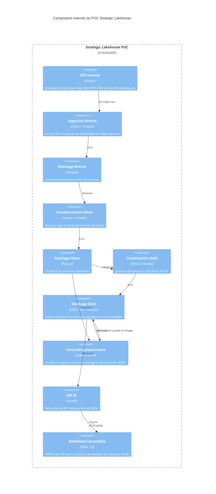

# Diagramme de composants Lakehouse

## A defendre

Chaque composant correspond a une responsabilite claire. Le POC reste simple, mais il respecte la logique d'une architecture Lakehouse : ingestion, stockage par couches, transformation progressive, controles de gouvernance, puis exposition BI via API.
