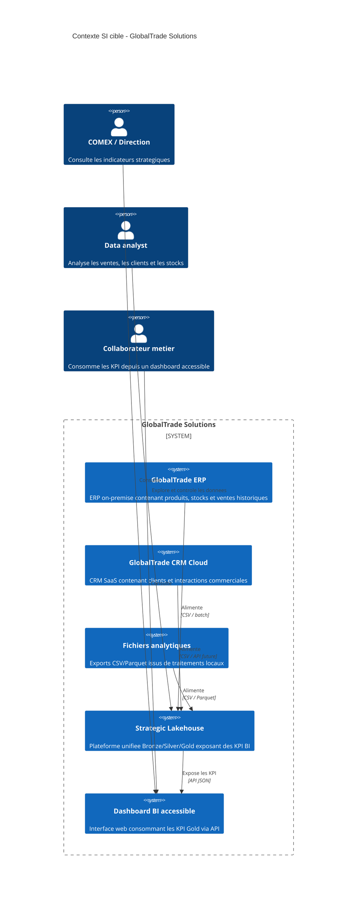

# Diagramme de contexte systeme

## A defendre

Ce diagramme montre le passage d'un SI fragmente vers un systeme analytique unifie. L'ERP, le CRM et les fichiers restent des sources distinctes, mais le Lakehouse devient la couche centrale de consolidation, de qualite et d'exposition BI.
