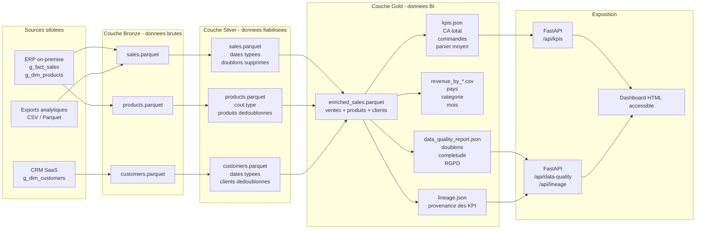

# Diagramme de flux d'ingestion Bronze / Silver / Gold

## A defendre

Le flux illustre la valeur ajoutee de chaque couche. Bronze securise l'ingestion, Silver rend les donnees fiables, Gold produit des indicateurs et des controles de gouvernance, puis l'API permet de les consommer sans acceder directement aux fichiers internes.
