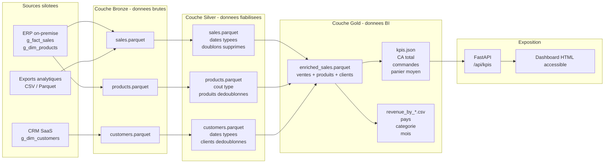

# Diagramme de flux d'ingestion Bronze / Silver / Gold

## A defendre

Le flux illustre la valeur ajoutee de chaque couche. Bronze securise l'ingestion, Silver rend les donnees fiables, Gold produit des indicateurs directement exploitables par la BI, puis l'API permet de consommer ces indicateurs sans acceder directement aux fichiers internes.
